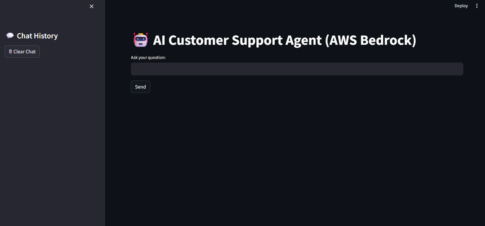

# 🤖 AI Customer Support Agent (AWS Bedrock)

[](https://aws.amazon.com/bedrock/)
[](https://aws.amazon.com/bedrock/llama/)
[](https://streamlit.io/)
[](https://www.python.org/)
[](LICENSE)

---

A Streamlit-based customer support chatbot that combines rule-based intent
routing with an LLM fallback powered by **Amazon Bedrock** (Meta LLaMA 3).
Instead of sending every message straight to the LLM, the agent first checks
for known intents (email requests, complaints/tickets, FAQs) and only falls
back to Bedrock for genuinely open-ended queries - keeping responses fast
and cheap for the common cases.

---

## Screenshots

| Chat interface | Sample interaction |
|---|---|
|  |  |

---

## How it works

Each user message is routed in a fixed order:

1. **Intent detection** (`tools.py::detect_intent`) - checks for email
   keywords (`email`, `send email`, `contact support`, `mail`) and complaint
   keywords (`not delivered`, `damaged`, `failed`, `issue`, `complaint`,
   `delayed`, `problem`, `broken`). Email keywords are checked first, so a
   message like *"Send an email regarding refund"* is routed to email
   handling rather than being swallowed by a refund-related path.
2. **FAQ lookup** (`tools.py::get_faq_answer`) - fast keyword-matched
   answers for topics like refunds, delivery time, and order tracking.
3. **LLM fallback** (`agent.py::invoke_bedrock`) - for anything not caught
   above, the query (along with the last few turns of conversation history)
   is sent to the Bedrock model for a generated response.

Conversation history is persisted per session to `chat_history.json`
(`memory.py`), with a simple in-process lock to avoid read/write races. The
last 5 turns are pulled back in as short-term context whenever a query falls
through to the LLM.

---

## Project structure

```
.
├── app.py               # Streamlit UI - chat input, history display, sidebar
├── agent.py              # Routing logic, prompt building, Bedrock invocation
├── tools.py               # Intent detection, FAQ answers, ticket creation, email stub
├── memory.py              # JSON-backed chat history (save/get/get_recent)
├── config.py               # Boto3 Bedrock client setup (reads .env)
├── requirements.txt
├── support ques.txt        # Sample queries for manually testing each route
└── screenshots/
    ├── Preview.png
    └── Result.png
```

---

## Setup

### 1. Clone and install dependencies

```bash
git clone https://github.com/Chowdri-Furkhan07/agent_bedrock.git
cd agent_bedrock
pip install -r requirements.txt
```

### 2. Configure AWS credentials

Create a `.env` file in the project root (this file is **not** committed —
see `.gitignore`) with:

```env
AWS_ACCESS_KEY_ID=
AWS_SECRET_ACCESS_KEY=
AWS_REGION=us-east-1
MODEL_ID=meta.llama3-8b-instruct-v1:0
```

- `AWS_ACCESS_KEY_ID` / `AWS_SECRET_ACCESS_KEY` — credentials for an AWS IAM
  user/role with `bedrock:InvokeModel` permission.
- `AWS_REGION` - the AWS region your Bedrock model access is enabled in.
- `MODEL_ID` - the Bedrock model ID to invoke (defaults to LLaMA 3 8B
  Instruct above; swap for another Bedrock model ID if you have access to
  one).

You'll also need model access enabled for the chosen model in the
[Bedrock console](https://console.aws.amazon.com/bedrock/) for your account
and region.

### 3. Run the app

```bash
streamlit run app.py
```

## Usage

Type a question into the input box and hit **Send**. A few examples that
exercise each routing path (see `support ques.txt` for more):

| Query | Route |
|---|---|
| "My order is not delivered" | Ticket creation |
| "What is the refund policy?" | FAQ |
| "Send an email regarding refund" | Email handoff |
| "Can you help me with delivery issue?" | LLM fallback |

Chat history is shown in the main panel and mirrored in the sidebar. Use
**🗑 Clear Chat** in the sidebar to reset the session (this starts a new
session ID; the previous session's history remains in `chat_history.json`).

## Notes

- `create_ticket` and `send_email` in `tools.py` are currently mocked —
  they generate a ticket ID / confirmation message but don't integrate with
  a real ticketing or email system.
- `chat_history.json` is written to the project root at runtime; treat it
  as local/session data rather than something to commit.

## Author

**Chowdri Furkhan**

GitHub: [@Chowdri-Furkhan07](https://github.com/Chowdri-Furkhan07)

## License

MIT - see [LICENSE](LICENSE).

